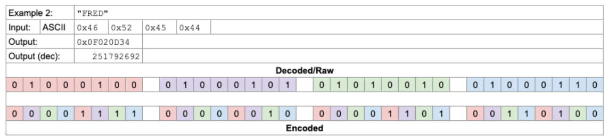

# Cryptography Coding Challenge
This is a coding challege I completeed that encodes bundles of 4 characters by scrambling them into 32-bit integer values for transmission, then reverses the operation on the receive end to reconstitute the original text.

## How to run
 - Run UI.py to get command line promps to encode/decode a message
 - Import Encryption from Encryption.py and call encode() by passing in a string such as encode("test") 
 - Import Encryption from Encryption.py and call decode() by passing s list of ints
such as decode([267487694, 125043731])
 - Run testEncryption.py to perform unit tests